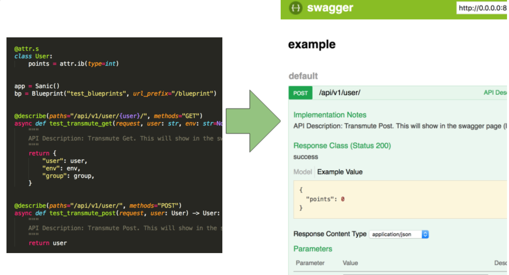

sanic-transmute
==================

.. start-badges

.. list-table::
    :stub-columns: 1

    * - Build
      - | |travis| |coverage|
    * - Docs
      - |docs|
    * - Package
      - | |version| |wheel| |supported-versions| |supported-implementations|

.. |travis| image:: https://travis-ci.org/yunstanford/sanic-transmute.svg?branch=master
    :alt: Travis-CI Build Status
    :target: https://travis-ci.org/yunstanford/sanic-transmute

.. |coverage| image:: https://coveralls.io/repos/github/yunstanford/sanic-transmute/badge.svg?branch=master
    :alt: coverage status
    :target: https://coveralls.io/github/yunstanford/sanic-transmute?branch=master

.. |docs| image:: https://readthedocs.org/projects/sanic-transmute/badge/?style=flat
    :target: https://readthedocs.org/projects/sanic-transmute
    :alt: Documentation Status

.. |version| image:: https://img.shields.io/pypi/v/sanic-transmute.svg
    :alt: PyPI Package latest release
    :target: https://pypi.python.org/pypi/sanic-transmute

.. |wheel| image:: https://img.shields.io/pypi/wheel/sanic-transmute.svg
    :alt: PyPI Wheel
    :target: https://pypi.python.org/pypi/sanic-transmute

.. |supported-versions| image:: https://img.shields.io/pypi/pyversions/sanic-transmute.svg
    :alt: Supported versions
    :target: https://pypi.python.org/pypi/sanic-transmute

.. |supported-implementations| image:: https://img.shields.io/pypi/implementation/sanic-transmute.svg
    :alt: Supported implementations
    :target: https://pypi.python.org/pypi/sanic-transmute

.. end-badges

Easily document your Sanic API with Swagger UI, Plus param validation and model serialization.

You can find out more here:

http://sanic-transmute.readthedocs.io/en/latest/

-------------------------
What is sanic-transmute ?
-------------------------

A `transmute
<http://transmute-core.readthedocs.io/en/latest/index.html>`_
framework for `sanic <http://sanic.readthedocs.io/en/latest/>`_. This
framework provides:

* declarative generation of http handler interfaces by parsing function annotations
* validation and serialization to and from a variety of content types (e.g. json or yaml).
* validation and serialization to and from native python objects, using `attrs <https://www.attrs.org/>`_ and `schematics <http://schematics.readthedocs.org/en/latest/>`_.
* autodocumentation of all handlers generated this way, via `swagger <http://swagger.io/>`_.

-----------
Quick Start
-----------

Overview:

Find Examples here:

* `example with attrs model <https://github.com/yunstanford/sanic-transmute/blob/master/examples/example_attrs_model.py>`_.
* `example with schematic model <https://github.com/yunstanford/sanic-transmute/blob/master/examples/example_schematics_model.py>`_.

Simple example with schematics model.

.. code-block:: python

    from sanic import Sanic, Blueprint
    from sanic.response import json
    from sanic_transmute import describe, add_route, add_swagger, APIException
    from sanic.exceptions import ServerError
    from schematics.models import Model
    from schematics.types import IntType

    class User(Model):
        points = IntType()

    app = Sanic()
    bp = Blueprint("test_blueprints", url_prefix="/blueprint")

    @describe(paths="/api/v1/user/{user}/", methods="GET")
    async def test_transmute(request, user: str, env: str=None, group: [str]=None):
        """
        API Description: Transmute Get. This will show in the swagger page (localhost:8000/api/v1/).
        """
        return {
            "user": user,
            "env": env,
            "group": group,
        }

    @describe(paths="/killme")
    async def handle_exception(request) -> User:
        """
        API Description: Handle exception. This will show in the swagger page (localhost:8000/api/v1/).
        """
        raise ServerError("Something bad happened", status_code=500)

    @describe(paths="/api/v1/user/missing")
    async def handle_api_exception(request) -> User:
        """
        API Description: Handle APIException. This will show in the swagger page (localhost:8000/api/v1/).
        """
        raise APIException("Something bad happened", code=404)

    @describe(paths="/multiply")
    async def get_blueprint_params(request, left: int, right: int) -> str:
        """
        API Description: Multiply, left * right. This will show in the swagger page (localhost:8000/api/v1/).
        """
        res = left * right
        return "{left}*{right}={res}".format(left=left, right=right, res=res)

    if __name__ == "__main__":
        add_route(app, test_transmute)
        add_route(app, handle_exception)
        add_route(app, handle_api_exception)
        # register blueprints
        add_route(bp, get_blueprint_params)
        app.blueprint(bp)
        # add swagger
        add_swagger(app, "/api/v1/swagger.json", "/api/v1/")
        app.run(host="0.0.0.0", port=8000)

Simple example with attrs model.

.. code-block:: python

    from sanic import Sanic, Blueprint
    from sanic.response import json
    from sanic_transmute import describe, add_route, add_swagger, APIException
    from sanic.exceptions import ServerError
    import attr

    @attr.s
    class User:
        points = attr.ib(type=int)

    app = Sanic()
    bp = Blueprint("test_blueprints", url_prefix="/blueprint")

    @describe(paths="/api/v1/user/{user}/", methods="GET")
    async def test_transmute_get(request, user: str, env: str=None, group: [str]=None):
        """
        API Description: Transmute Get. This will show in the swagger page (localhost:8000/api/v1/).
        """
        return {
            "user": user,
            "env": env,
            "group": group,
        }

    @describe(paths="/api/v1/user/", methods="POST")
    async def test_transmute_post(request, user: User) -> User:
        """
        API Description: Transmute Post. This will show in the swagger page (localhost:8000/api/v1/).
        """
        return user

    @describe(paths="/killme")
    async def handle_exception(request) -> User:
        """
        API Description: Handle exception. This will show in the swagger page (localhost:8000/api/v1/).
        """
        raise ServerError("Something bad happened", status_code=500)

    @describe(paths="/api/v1/user/missing")
    async def handle_api_exception(request) -> User:
        """
        API Description: Handle APIException. This will show in the swagger page (localhost:8000/api/v1/).
        """
        raise APIException("Something bad happened", code=404)

    @describe(paths="/multiply")
    async def get_blueprint_params(request, left: int, right: int) -> str:
        """
        API Description: Multiply, left * right. This will show in the swagger page (localhost:8000/api/v1/).
        """
        res = left * right
        return "{left}*{right}={res}".format(left=left, right=right, res=res)

    if __name__ == "__main__":
        add_route(app, test_transmute_get)
        add_route(app, test_transmute_post)
        add_route(app, handle_exception)
        add_route(app, handle_api_exception)
        # register blueprints
        add_route(bp, get_blueprint_params)
        app.blueprint(bp)
        # add swagger
        add_swagger(app, "/api/v1/swagger.json", "/api/v1/")
        app.run(host="0.0.0.0", port=8000)

-----------
Development
-----------

Build.

.. code::

    ./uranium

Run unit tests.

.. code::

    ./uranium test
