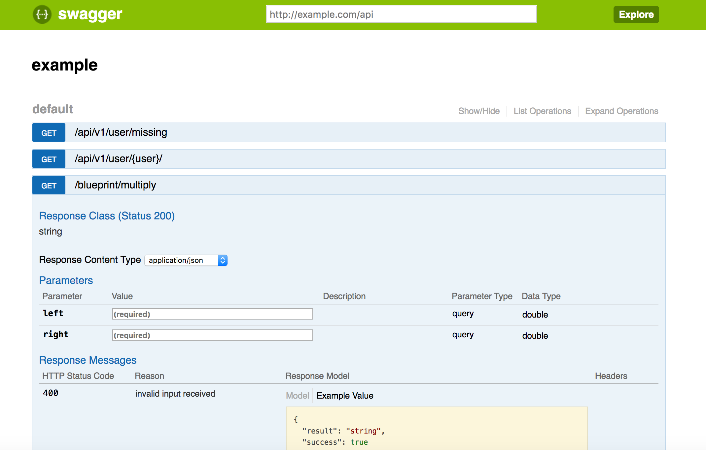

=================
Autodocumentation
=================

You can use add_swagger(app, json_path, html_path) to add swagger documentation
for all transmute routes.

.. code-block:: python

    sanic_transmute.add_swagger(app, "/api/v1/swagger.json", "/ap1/v1")

The swagger page looks like,

-------------
API Reference
-------------

.. autofunction:: sanic_transmute.add_swagger
